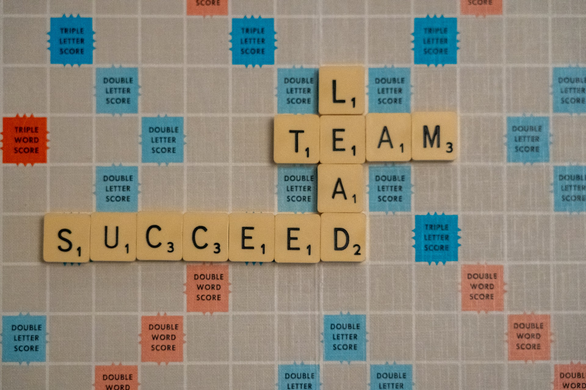

```{r child = "../setup.Rmd"}
```


```{r}

library(dplyr)
library(readr)

```

```{r, layout="l-body", preview=TRUE, echo=FALSE, include=TRUE, fig.cap="Photo by: [Nick Fewings](https://unsplash.com/@jannerboy62)"}



```

# Learning Objectives

## Part 2

These learning objectives are related to the assignment for this week.

```{r}

lobj2 <- read_csv(here::here("data/tab-01_rbtl-learning-objectives.csv")) %>% 
  filter(week == params$week) %>% 
  pull(learning_objectives_pt2)

```

1. `r lobj2[1]`
1. `r lobj2[2]`

# Slides

```{r}

read_csv(here::here("data/tab-02_rtbl-slides-resources.csv")) %>% 
  filter(week == params$week) %>% 
  select(title, lecturer, part, slides) %>% 
  kableExtra::kbl() %>% 
  kableExtra::kable_styling(bootstrap_options = c("striped", "hover"), full_width = TRUE, position = "left")

```

# Group work

Individuals, not groups, will partner up to give and answer their questionnaire during class so that trouble-shooting and revisions can be done before the study. 

# Homework

```{r, layout="l-page", echo=FALSE, message=FALSE, warning=FALSE}

read_csv(here::here("data/tab-03_rbtl-course-assignments.csv")) %>% 
  filter(week == params$week) %>% 
  arrange(desc(effort_estimate_min)) %>% 
  mutate(id = seq(1:n())) %>% 
  select(id, title_link, type,  category, effort_estimate_min, submission_format, due_date) %>% 
  knitr::kable() %>% 
  kableExtra::column_spec(7, width = "10em", background = "#E8ADAA")

```