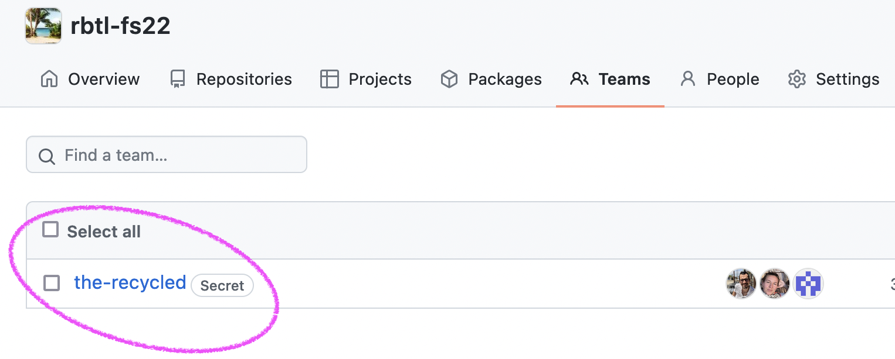
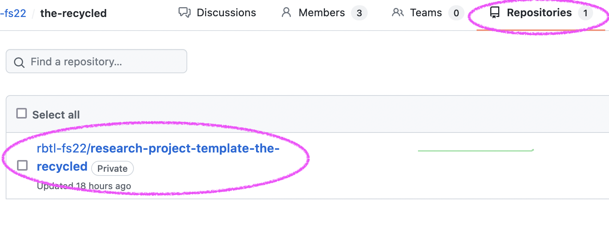
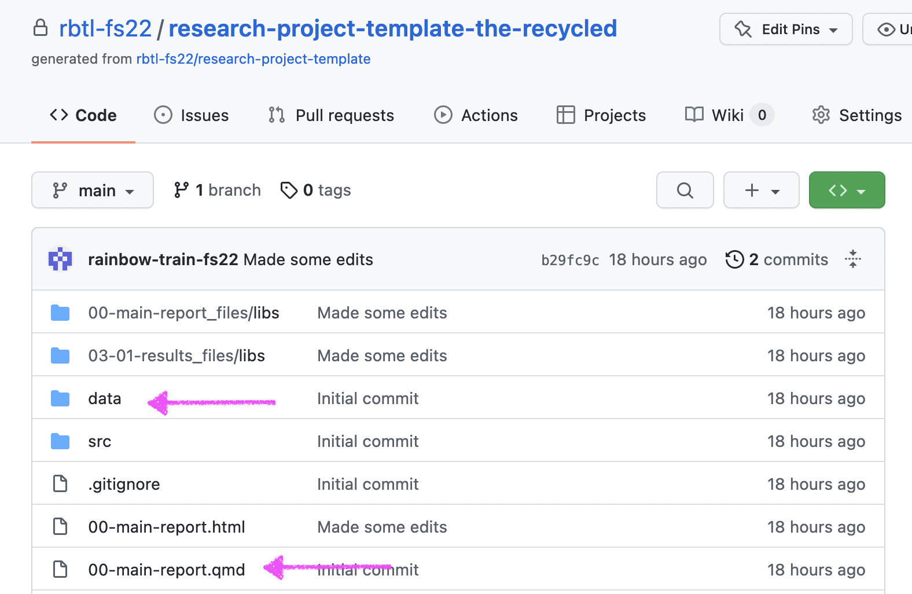
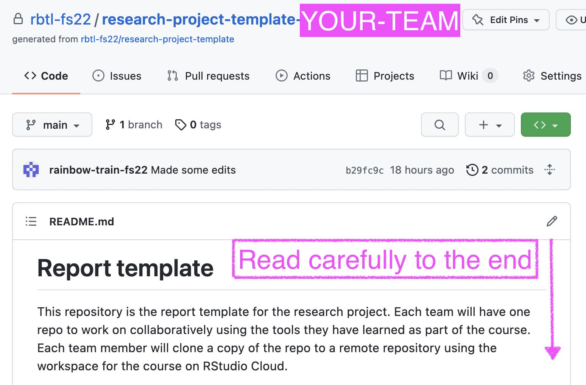

<script defer data-domain="rbtl-fs22.github.io/website" src="https://plausible.io/js/plausible.js"></script>

```{r setup, include=FALSE}
knitr::opts_chunk$set(echo = FALSE)
```

# Introduction

Now that you have your data, we will set you up to start working collaboratively on your report. This homework is about familiarising yourself with the report template. You will also read about exploratory data visualisation, which is our topic for next week. 

## Prerequisites

We assume that you have:

1. Collected your data 

## Learning Objectives

1. Learners can import their data from a CSV file to a team repository on GitHub
2. Learners can list the six elements of the data science lifecycle 
3. Learners know three different ways of getting support in solving coding problems online

## Terminology {#terminology}

# Exercises

## Exercise 1 - Application Exercise

1. Open the repo from class and `pull` changes from remote repository; A solutions file `ae-10a-lifecycle-solutions.qmd` will be added; Ensure that your script `ae-10a-lifecycle.qmd` is complete and renders without errors
2. Add, Commit, Push all changes to GitHub with the commit message "Render exercise 10a without errors"
3. Complete all tasks in Application Exercise 10 - Data Science Lifecycle (`ae-10b-lifecycle.qmd` file) 
4. Ensure that `ae-10b-lifecycle.qmd` renders without errors
4. Add, Commit, Push all changes to GitHub with the commit message "Complete tasks of exercise 10b"

## Exercise 2 - Find your team

You have been added to a [team in the rbtl-fs22](https://github.com/orgs/rbtl-fs22/teams) organisation on GitHub. Your team has a team repo,  research-project-template-[TEAM-NAME], which you will work on collaboratively. 

1. Open your team page and set a bookmark in your browser.(All teams: https://github.com/orgs/rbtl-fs22/teams)

```{r}

```


2. Open the team repo for the research project template.

```{r}

```

3. Explore the content of the repo in your browser on GitHub (click on the files, click on the folders, etc.)

```{r}

```

4. Carefully read all sections of the `README.md` that is contained in the main directory of your research-project-template team repo (see Screenshot below)

```{r}

```

5. Write up at least two questions and add them as an issue to your research-project-template team repo tagging @larnsce in the issue

6. Decide in your group who will work in which "Results & Discussions" file:

- 03-01-results.qmd
- 03-02-results.qmd
- 03-03-results.qmd

7. Open an issue on the the research-project-template team repo to let us know who will work in which file

## Exercise 3 - Clone your team repo; add your data

1. Decide who in your group will upload the data to your research-project-template team repo (only one person per data set)
2. Clone your research-project-template team repo to the rbtl-fs22 workspace on RStudio Cloud
3. If you were assigned to upload a data set, use the RStudio file manager (bottom right window) to upload the data to the `data/raw_data` drectory of your research-project-template team repo

## Exercise 4 - Get started with your analysis

1. Open your research-project-template team repo on the RStudio Cloud
2. From the file manager (bottom right window), open your assigned  "Results & Discussions" file
3. Add a 1st level heading titled "Data import"
4. Add a code-chunk below the first level heading
5. Load the `readr` R package using the `library()` function
5. Render the file without any errors
6. Add, commit, push your changes back to GitHub

## Exercise 5 - Read R4DS and practice

The open and free book, R for Data Science (R4DS) is a very popular resource to learn programming in R. A online learning community was formed that work through the book together. The book is an excellent resource for you to continue your path of working with R beyond the scope of what we can teach in our rtbl course. 

The book is full of code examples that you can copy and run yourself. It is good practice to do that in a notebook specifically used for this purpose. We have setup a notebook repository for you, which you can use in parallel to reading the book. It is up to you how many notes you want to take or whether you want to try and work through the exercises in the sections that we assign to read as homework. 

Learning programming in R is a long journey, which requires continuous practice. It is more beneficial to work three times one hour per week, then one day a week for three hours. When you learn programming, the journey never ends, but you will move from being a [novice](http://teachtogether.tech/en/index.html#g:novice), to being a [competent practitioner](http://teachtogether.tech/en/index.html#g:competent-practitioner), and finally to being an [expert](http://teachtogether.tech/en/index.html#g:expert). Your interest and motivation will show which direction you will take, but using R4DS as learning material will provide you with a very solid foundation that can be extended into many others areas of using R for your work. 

1. Open the rbtl-fs22 GitHub organisation and clone the notebook repo with your name (notebook-[GITHUB_USERNAME]) to the rbtl-fs22 workspace on RStudio Cloud.
2. Read Chapter Introduction of R4DS: https://r4ds.had.co.nz/explore-intro.html 
3. Read Chapter Data Visualisation (3.1 to 3.6) of R4DS: https://r4ds.had.co.nz/data-visualisation.html

**Note: If you use the notebook to take notes while working through R4DS, then use the Render, Add, Commit, Push workflow every now and then to push your changes back to GitHub and keep your remote repository in sync with your local repository.**


