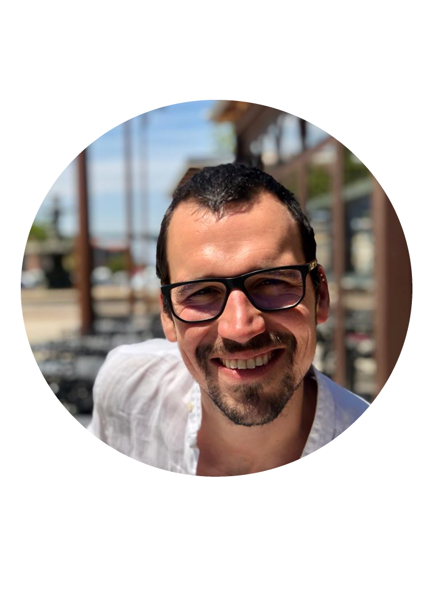

```{r child = "../setup.Rmd"}
```


---
class: middle

# .big[Welcome! `r emo::ji("wave")`]

---
# Goals for today

You...

...know a bit about me and I know a bit about you. 

...know the learning outcomes and competencies you gain in this course.  

...are aware of the tools that we use for this course.

...know where to find the link to the course website.  

...understand the grading scheme for this course.  

...are motivated to do your homework and come back next week.  

---
.pull-left[
.large[**Lars Schöbitz**]

- Environmental Engineer  
- Open Science Specialist  
- Instructor for Data Science with R  
- Online: [@larnsce](https://twitter.com/larnsce)
]

.pull-right[
```{r, echo = FALSE, out.width="70%"}

```
]

---
# You

Hands-up:

- Who has used **R** before?
- Who think they know what **version control software** is?
- Who has an account for **Slack**?
- Who has an account for **GitHub**?

---
class: inverse, middle

# .big[Learning outcomes]

---
# Learning outcomes of this course

At the end of this course, students will be able to:

- practice Open Science and publish data projects reproducibly 
- work collaboratively with Git and GitHub
- understand the concept of Tidy Data
- conduct Exploratory Data Analysis
- help themselves and others in learning more about data science with R

---
class: inverse, middle

# .big[Toolbox `r emo::ji("toolbox")`]

---
# Toolbox

.pull-left[

# **Course work**

- Classroom
- Field work 
- Zoom 
- Slack (not yet decided)
]

.pull-right[

# Data Science

**Programming**

- R
- RStudio (Cloud)
- tidyverse R Packages
- R Markdown

**Version control and Collaboration**

- Git
- GitHub

]

---
class: center, middle

.big[https://rbtl-fs22.github.io/website/]

---
# Grading scheme - Summary

```{r}

read_csv(here::here("data/tab-05_rbtl-grading-structure.csv")) %>% 
  mutate(type = factor(type,levels = c("homework", "project", "exam"))) %>% 
  group_by(type) %>% 
  summarise(
    percent = sum(percent)
  ) %>% 
  kbl() %>% 
  kable_styling(font_size = 45) 

```


---
# Grading scheme - Homework

- 10 assignments, submitted weekly
- Assignment submitted in time: 2%
- Assignment submitted late: 1%
- Assignment not submitted: no progress

---
# Grading scheme - Group project

- 30% for final group project report, submitted in Week 15
    - 20% for technical parts of final report 
    - 10% for intellectual framing of the results
- All items that we grade will be communicated on the website

---
# Grading scheme - Exam

- 50% for end-of-semester Exam in Week 16
- Two hour programming exam
- Free use of course material and online material
- Tests for technical aspects taught during the course

---
class: inverse, center, middle

# .large[Why take this course?] 


---


---
class: center, middle

# Thanks!

Slides created via the R packages:

[**xaringan**](https://github.com/yihui/xaringan)<br>
[gadenbuie/xaringanthemer](https://github.com/gadenbuie/xaringanthemer)

The chakra comes from [remark.js](https://remarkjs.com), [**knitr**](http://yihui.name/knitr), and [R Markdown](https://rmarkdown.rstudio.com).
