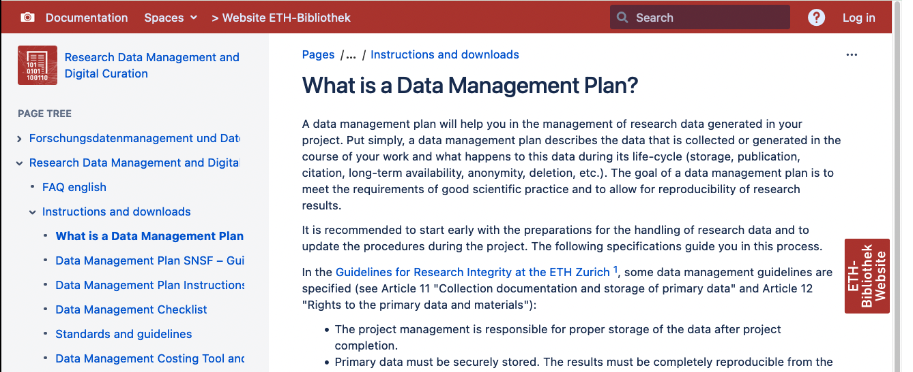
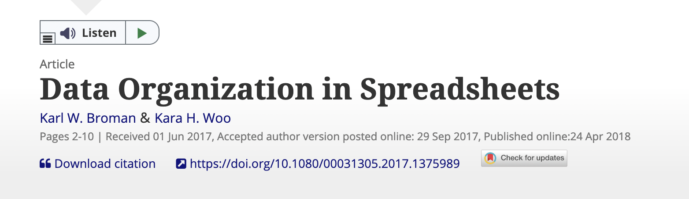
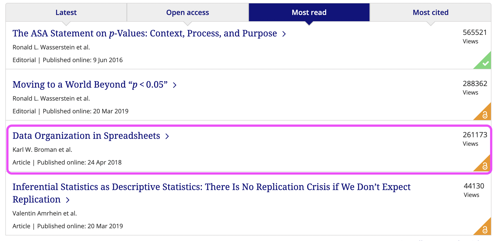
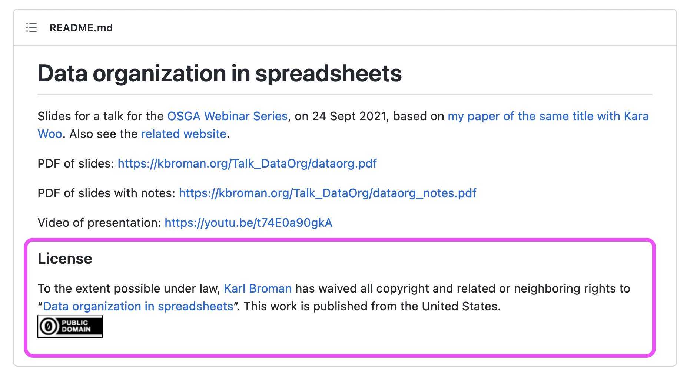

```{r child = "../setup.Rmd"}
```

```{r}
library(tidyverse)
library(lubridate)
```

# Today

1. Homework Assignment 4 - Solutions
2. Week 5 - Learning Objectives
3. Research Data Management
4. Data Organisation in Spreadsheets
5. Homework Assignment 5


---
class: inverse, middle

.big[Homework Assignment 4]

---
# Think, Pair, Share

.question[
1. What is the difference between markdown and R Markdown?
2. How does a file written in markdown differ from a file in a proprietary file fornat (e.g. .docx)? 
]

.your-turn[
- **Think** for 2 minutes
- **Pair** with your neighbour for 4 minutes
- **Share** your answer with the class
]

```{r, echo = FALSE}

countdown(
  minutes = 2, seconds = 0,
  left = 0, right = 0,
  padding = "10px", margin = "5%",
  font_size = "2em"
)

```

---
class: left
background-image: url(img/assignment-solutions.png)
background-size: contain

# Homework Assignment 4 - Solutions

---
class: left
background-image: url(img/illustration-slides-week4.010.png)
background-size: contain

---
class: inverse, middle

.big[Week 5 - Learning Objectives]

---
# Week 5 - Learning Objectives

1. Learners can use a tool for survey design for 12 to 15 questions ~~using at least two elements of survey logic~~

2. Learners can apply 12 principles for data organisation in spreadsheets in the layout of a collected dataset

3. Learners understand the importance of documentation and metadata for (research) data management

---
class: inverse, middle

.big[Research Data Management]

---
# Research Data Management

> Acronym: RDM. Refers to the organisation, storage and preservation of data created during a research project. It covers initial planning, day-to-day processes and long-term archiving and sharing. Shortened to RDM. - [Reference](https://the-turing-way.netlify.app/afterword/glossary.html#term-Research-Data-Management)

---
# Research Data Management

- ensures efficiency in research workflows
- enables greater reach and impact ([FAIR principles](https://the-turing-way.netlify.app/reproducible-research/rdm/rdm-fair.html?highlight=fair))
- prevents loss and data corruption
- documentation and metadata ensures access and enables reuse for others

???
1. You will always find your data
2. You get recognition for all research outputs
3. You stimulate collaboration who find it easier to understand and reuse your data


---
class: middle

## .large[The FAIR principles]


---
class: left
background-image: url(https://the-turing-way.netlify.app/_images/fair-principles.jpg)
background-size: contain

.footnote[The Turing Way Community, & Scriberia. (2021). Illustrations from the Turing Way book dashes. Zenodo. https://doi.org/10.5281/zenodo.5706310]

???

The FAIR guiding principles for scientific data management and stewardship were developed as guidelines to improve the:

- **Findable:** The first step in (re)using data is to find them! Descriptive metadata (information about the data such as keywords) are essential.

- **Accessible:** Once the user finds the data and software they need to know how to access it. Data could be openly available but it is also possible that authentication and authorisation procedures are necessary.

- **Interoperable:** Data needs to be integrated with other data and interoperate with applications or workflows.

- **Reusable:** Data should be well-described so that they can be used, combined, and extended in different settings.

all of which support research reproducibility. The FAIR principles play an important role in making your data available to others for reuse.

Reference: https://the-turing-way.netlify.app/reproducible-research/rdm/rdm-fair.html?highlight=fair#

---
class: middle

## .large[Research Data Lifecycle]


---
##  Research Data Lifecycle 

<iframe width="1000" height="515" src="https://www.youtube.com/embed/-wjFMMQD3UA" title="YouTube video player" frameborder="0" allow="accelerometer; autoplay; clipboard-write; encrypted-media; gyroscope; picture-in-picture" allowfullscreen></iframe>

.footnote[Reference: https://www.youtube.com/watch?v=-wjFMMQD3UA]

???

### Point out

1. Planning research

- data management plans right in the beginning when you design your research

2. Collecting data

- We will get into capturing data with metadata

3. Processing and analysing data

- That's what will start from week 8

4. Publishing and sharing data

- That's what most of today is about
- We have already talked about licenses

5. Preserving data

- Store and backup: You are continously doing that by the use of a remote repository (GitHub)

6. Re-using data

- That's what we hope to be able to do following the course and include you all as co-authors of a publication

---
class: middle

## .large[Data Management Plan]

---
## Data Management Plan

Provides information on five main topics:

1. Roles and Responsibilities
2. Type and size of data collected and documentation/metadata generated
3. Type of data storage used and back up procedures that are in place
4. Preservation of the research outputs after the project
5. Reuse of your research outputs by others

.footnote[Reference: https://the-turing-way.netlify.app/reproducible-research/rdm/rdm-dmp.html]

---
## Data Management Plan

Provides information on five main topics:

1. Roles and Responsibilities
2. Type and size of data collected and **documentation/metadata** generated
3. Type of data storage used and back up procedures that are in place
4. Preservation of the research outputs after the project
5. Reuse of your research outputs by others

.footnote[Reference: https://the-turing-way.netlify.app/reproducible-research/rdm/rdm-dmp.html]


---
## Data Management Plan

[
```{r}

```
](https://documentation.library.ethz.ch/pages/viewpage.action?pageId=9207835)

.footnote[Screenshot, 2022-03-22: [ETH Library - Research Data Management and Digital Curation - What is a Data Management Plan?](https://documentation.library.ethz.ch/pages/viewpage.action?pageId=9207835)]

---
class: middle

## .large[Documentation and Metadata]

---
## You got data. Is it enough?

<blockquote class="twitter-tweet" data-conversation="none" data-lang="en"><p lang="en" dir="ltr"><a href="https://twitter.com/tomjwebb">@tomjwebb</a> I see tons of spreadsheets that i don&#39;t understand anything (or the stduent), making it really hard to share.</p>&mdash; Erika Berenguer (@Erika_Berenguer) <a href="https://twitter.com/Erika_Berenguer/status/556111838715580417">January 16, 2015</a></blockquote>
<script async src="//platform.twitter.com/widgets.js" charset="utf-8"></script>


<blockquote class="twitter-tweet" data-conversation="none" data-lang="en"><p lang="en" dir="ltr"><a href="https://twitter.com/tomjwebb">@tomjwebb</a> <a href="https://twitter.com/ScientificData">@ScientificData</a> &quot;Document. Everything.&quot; Data without documentation has no value.</p>&mdash; Sven Kochmann (@indianalytics) <a href="https://twitter.com/indianalytics/status/556120920881115136">January 16, 2015</a></blockquote>
<script async src="//platform.twitter.com/widgets.js" charset="utf-8"></script>

.footnote[Slide taken from: https://annakrystalli.me/rrresearchACCE20/metadata-slides.html#metadata-slides]

???
Question on Twitter:

**If you could tell a new PhD student one thing to help make their data more useful/shareable, what would it be?**


---
## You got data. Is it enough?

<blockquote class="twitter-tweet" data-conversation="none" data-lang="en"><p lang="it" dir="ltr"><a href="https://twitter.com/tomjwebb">@tomjwebb</a> Annotate, annotate, annotate!</p>&mdash; CanJFishAquaticSci (@cjfas) <a href="https://twitter.com/cjfas/status/556109252788379649">January 16, 2015</a></blockquote>
<script async src="//platform.twitter.com/widgets.js" charset="utf-8"></script>

<blockquote class="twitter-tweet" data-conversation="none" data-lang="en"><p lang="und" dir="ltr">Document all the metadata (including protocols).<a href="https://twitter.com/tomjwebb">@tomjwebb</a></p>&mdash; Ward Appeltans (@WrdAppltns) <a href="https://twitter.com/WrdAppltns/status/556108414955560961">January 16, 2015</a></blockquote>
<script async src="//platform.twitter.com/widgets.js" charset="utf-8"></script>

.footnote[Slide taken from: https://annakrystalli.me/rrresearchACCE20/metadata-slides.html#metadata-slides]

---
# Think, Pair, Share

<blockquote class="twitter-tweet" data-lang="en"><p lang="en" dir="ltr">You download a zip file of <a href="https://twitter.com/hashtag/OpenData?src=hash">#OpenData</a>. Apart from your data file(s), what else should it contain?</p>&mdash; Leigh Dodds (@ldodds) <a href="https://twitter.com/ldodds/status/828657155863638016">February 6, 2017</a></blockquote>
<script async src="//platform.twitter.com/widgets.js" charset="utf-8"></script>

.footnote[Slide taken from: https://annakrystalli.me/rrresearchACCE20/metadata-slides.html#metadata-slides]

---
# Think, Pair, Share

## **Thought experiment: Imagine a dream open data set**

.question[
1. How would you locate it?
1. What details would you need to know to determine relevance? 
2. What information would you need to know to use it?
]

.your-turn[
- **Think** for 2 minutes
- **Pair** with your neighbour for 4 minutes
- **Share** your answer with the class
]

```{r, echo = FALSE}

countdown(
  minutes = 2, seconds = 0,
  left = 0, right = 0,
  padding = "10px", margin = "5%",
  font_size = "2em"
)

```

.footnote[Slide adapted from: https://annakrystalli.me/rrresearchACCE20/metadata-slides.html#metadata-slides]


---
## ETH library

### Data Management Plan Instructions for ETH Zurich Researchers

**Section 1: Data collection and documentation**

- 1.3 What documentation and metadata will you provide with the data?
    - What information about your data (i.e., metadata) is required to make reuse of your data in the future?
    - Are you using certain community standards for the annotation of metadata?
    - How will data documentation be carried out?
    
.footnote[[Data Management Plan Instructions for ETH Zurich Researchers](https://documentation.library.ethz.ch/display/DD/Data+Management+Plan+Instructions+for+ETH+Zurich+Researchers)]

---
#### Q1: What information about your data (i.e., metadata) is required to make reuse of your data in the future?

- Codebook or data dictionaries that define and explain all variables in your data
- A human and machine-readable file (e.g. README.md) that contains general information on:
    - Title of the dataset
    - Description of the dataset
    - Author information (Name, Institution, Address, Email)
    - Date of data collection (begin, end)
    - Geographic location of data collection
    - etc.
- A license to clarify reuse possibilties

---
#### Q2: Are you using certain community standards for the annotation of metadata?

- General metadata standards (e.g. [DublinCore](https://www.dublincore.org/specifications/), [schema.org](https://schema.org/), [R3data.org](https://www.re3data.org/))
- Domain specific standards (**we won't get into this**)

---
#### Q3: How will data documentation be carried out?

- Repository hosted on GitHub with license that clarifies use: [CC-BY-4.0](https://creativecommons.org/licenses/by/4.0/) 
- Respository has `/data` directory which contains:
  - **Codebook** (stored as `attributes.csv`) that describes all variables following [schema.org](https://schema.org/) standards
  - **README** hat contains information for each dataset, following variation of [Cornell University README template](https://cornell.app.box.com/v/ReadmeTemplate)
  
---
class: left
background-image: url(img/coffee-break.jpg)
background-position: right
background-size: contain

# Let's take a break 

```{r, echo = FALSE}

countdown(
  minutes = 10, seconds = 0,
  left = 0, right = 0,
  padding = "15px", margin = "5%",
  font_size = "4em"
)

```

.footnote[Photo by: [Blake Wisz](https://unsplash.com/@blakewisz)]

---
class: inverse, middle

.big[Data Collection Tools]


---
# Data Collection Tools

- Questionnaires for survey based data collection
- Spreadsheets for experimental data collection

---
class: middle

## .large[Surveys]

---
## Surveys 

**Commonly used in our sector**

- KOBO Toolbox
- mWater
- OpenDataKit

---
## ETH tool - Select Survey 

- Select Survey Portal https://selectsurvey.ethz.ch/
- [Select Survey User Manual](https://www.unlimited.ethz.ch/download/attachments/21126315/SelectSurveyNETUserManual.pdf?version=2&modificationDate=1592921608627&api=v2)
- [Select Survey IT Knowledge Base](https://www.unlimited.ethz.ch/display/itkb/Surveys)

---
## Live Demonstration - Select Survey

<div style="width:100%;height:0;padding-bottom:100%;position:relative;"><iframe src="https://giphy.com/embed/26tP4mS08o114G2kg" width="50%" height="50%" style="position:absolute" frameBorder="0" class="giphy-embed" allowFullScreen></iframe></div><p><a href="https://giphy.com/gifs/sehsucht-relax-newyearsresolution-adventcalendar-26tP4mS08o114G2kg">via GIPHY</a></p>

---
## Task - Fill out questionnaire

.your-turn[
- Open Slack and find the link to the questionnaire we have just created
- Fill out the questionnaire
]

---
## Live Demonstration - Writing a codebook

<div style="width:100%;height:0;padding-bottom:100%;position:relative;"><iframe src="https://giphy.com/embed/Xa4hAvnXUuKrKn1DpD" width="50%" height="50%" style="position:absolute" frameBorder="0" class="giphy-embed" allowFullScreen></iframe></div><p><a href="https://giphy.com/gifs/shaun-the-sheep-shaunthesheep-shaunthesheep6-Xa4hAvnXUuKrKn1DpD">via GIPHY</a></p>

---
class: left
background-image: url(img/coffee-break.jpg)
background-position: right
background-size: contain

# Let's take a break 

```{r, echo = FALSE}

countdown(
  minutes = 10, seconds = 0,
  left = 0, right = 0,
  padding = "15px", margin = "5%",
  font_size = "4em"
)

```

.footnote[Photo by: [Blake Wisz](https://unsplash.com/@blakewisz)]

---
class: middle

## .large[Data Organisation in Spreadsheets]

---
## Data Organisation in Spreadsheets

[
```{r}

```
](https://www.tandfonline.com/doi/full/10.1080/00031305.2017.1375989?src=)

.footnote[[Screenshot taken on 2022-03-23](https://www.tandfonline.com/doi/full/10.1080/00031305.2017.1375989?src=)]

---
## Data Organisation in Spreadsheets

Read the paper (it's part of your homework), but you can also:

- Go through the annoated slides: https://kbroman.org/Talk_DataOrg/dataorg_notes.pdf 
- Watch Karl Broman give the talk (02:36 to 45:00): https://youtu.be/t74E0a90gkA?t=156
- Read the content on a website: https://kbroman.org/dataorg/

---
### But, especially apply it to your data

<div style="width:100%;height:0;padding-bottom:100%;position:relative;"><iframe src="https://giphy.com/embed/UEGwYCVTBFa9tJEf66" width="50%" height="50%" style="position:absolute" frameBorder="0" class="giphy-embed" allowFullScreen></iframe></div><p><a href="https://giphy.com/gifs/rainbow-computer-data-UEGwYCVTBFa9tJEf66">via GIPHY</a></p>

---
### Why? 

**Because it will make your life easier!**

[
```{r, out.width="75%"}

```
](https://www.tandfonline.com/toc/utas20/current#b7689c1d-7975-46ed-aaf9-3a2939834054-b6de7b7c-de82-45a5-9538-313dd15c6659)

.footnote[Jorunal: The American Statistician, [Screenshot taken on 2022-03-23](https://www.tandfonline.com/toc/utas20/current#b7689c1d-7975-46ed-aaf9-3a2939834054-b6de7b7c-de82-45a5-9538-313dd15c6659)]

---
### License? CC0 (!)

[
```{r, out.width="75%"}

```
](https://github.com/kbroman/Talk_DataOrg)
.footnote[[Screenshot taken on 2022-03-23](https://github.com/kbroman/Talk_DataOrg)]

---
## Waste Characterisation - Data example

```{r}
tibble(
  bin_id = c(234, 234, 234, 234, 682, 682, 682, 682),
  collection_date = "2022-03-22",
  waste_category = rep(c("plastics", "metal", "pet", "other"), 2), 
  weight = c(2.5, 1.7, 0.8, 15, 6.5, 1.1, 7.8, 9.1)
) %>% 
  knitr::kable()
```

---
## Waste Characterisation - How to collect your data?

<blockquote class="twitter-tweet"><p lang="en" dir="ltr">Working with goats 🙄🤦‍♀️ <a href="https://t.co/PGBop7FqNo">pic.twitter.com/PGBop7FqNo</a></p>&mdash; Holly Vickery (@SkylarkHolly) <a href="https://twitter.com/SkylarkHolly/status/1460598999229083656?ref_src=twsrc%5Etfw">November 16, 2021</a></blockquote> <script async src="https://platform.twitter.com/widgets.js" charset="utf-8"></script>

---
class: inverse, middle

.big[Assignment 5]

---
# Assignment 5 

**Submit via GitHub by 2022-03-29 23:59**

1. ~~Groups~~ Students will program their revised questionnaire onto a digital platform so it is ready to use for the following class

2. ~~Groups~~ Students will transfer their variables into a spreadsheet database

3. ~~Groups~~ Students will write a codebook for their spreadsheet database

4. ~~Groups~~ Students will write a README for documentation of metadata

All details on website: https://rbtl-fs22.github.io/website/am-05-data-management.html

---
class: middle

## .large[Final excursion - File naming conventions]

---
## File naming conventions 

**Why?**

- to stay organised
- to not end up with: `'text is FINAL_v2-Ls.docx'`

---
## File naming conventions - Directories and files

**Rule 1:** Avoid capital letters

`project/rbtl/website/data/`

(if you want them, be consistent)

---
## File naming conventions - Directories and files

**Rule 2:** Avoid empty spaces

`project/rbtl/website/data/tab-01-rbtl-assignments.csv`


---
## File naming conventions - Directories and files

**Rule 3:** Use dash '-' to connect text strings in file names

`tab-01-rbtl-assignments.csv`

---
## File naming conventions - Directories and files

**Rule 4:** Avoid special characters (e.g %, £)

---
## File naming conventions - Directories and files

**Rule 5:** Use [ISO 8601](https://en.wikipedia.org/wiki/ISO_8601) date format: YYYY-MM-DD

`2022-03-21-waste-characterization-erz.csv`

---
## File naming conventions - Directories and files

**Rule 6:** Use names that are descriptive for the content

`2022-03-21-waste-characterization-erz.csv`

---
class: center, middle

# Thanks! `r emo::ji("sunflower")` 

Slides created via the R packages:

[**xaringan**](https://github.com/yihui/xaringan)<br>
[gadenbuie/xaringanthemer](https://github.com/gadenbuie/xaringanthemer)

The chakra comes from [remark.js](https://remarkjs.com), [**knitr**](http://yihui.name/knitr), and [R Markdown](https://rmarkdown.rstudio.com).

Access slides as [PDF on GitHub](https://rbtl-fs22.github.io/website/slides/pt2-d05-data-management/pt2-d05-data-management.pdf)

All material is licensed under [Creative Commons Attribution Share Alike 4.0 International](https://creativecommons.org/licenses/by-sa/4.0/). 