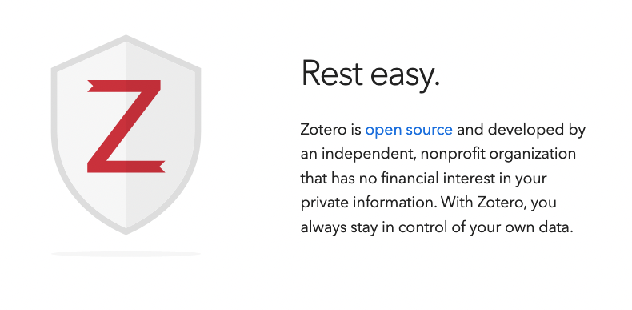

```{r child = "../setup.Rmd"}
```

```{r}
library(tidyverse)
library(palmerpenguins)
library(xaringanExtra)
```

# Today

1. Assignment grading and conversion
1. What is Version Control?
1. RStudio Cloud & RStudio IDE

---
class: inverse, middle

.big[Reference Management]


---
# Why?

- You will read a lot
- You want to stay organized
- You don't want to waste your time on formatting

---
# Which tool?

- Mendeley 
- EndNote
- Zotero
- many, many more

???

**Mendeley**

1. Mendeley belongs to Elsevier. 
2. It encrypts your database and makes money with your data
3. You can only collaborate with 3 people on one project.

**EndNote**

1. EndNote doesn't come free, you need to buy a license. 
2. They also used a prioprietary citation style files that could only be opened by EndNote.

---
# Which tool?

- Mendeley 
- EndNote
- **Zotero**

???

**Mendeley**

1. Mendeley belongs to Elsevier. 
2. It encrypts your database and makes money with your data
3. You can only collaborate with 3 people on one project.

**EndNote**

1. EndNote doesn't come free, you need to buy a license. 
2. They also used a prioprietary citation style files that could only be opened by EndNote.

---
# Why Zotero?

```{r echo=FALSE, out.width="100%"}

```

.footnote[[Screenshot taken from zotero.org on 2022-03-03](https://www.zotero.org/)]

---
# Open Source - Why is that good?

- Free
- Transparent about access to your own data
- The source code that Zotero is developed in is public
- Commitment to support open software and open standards
- Zotero developers helped create the [Citation Style Langauge (CSL)](https://citationstyles.org/)


---
class: center, middle

# Thanks! `r emo::ji("sunflower")` 

Slides created via the R packages:

[**xaringan**](https://github.com/yihui/xaringan)<br>
[gadenbuie/xaringanthemer](https://github.com/gadenbuie/xaringanthemer)

The chakra comes from [remark.js](https://remarkjs.com), [**knitr**](http://yihui.name/knitr), and [R Markdown](https://rmarkdown.rstudio.com).

All material is licensed under [Creative Commons Attribution Share Alike 4.0 International](https://creativecommons.org/licenses/by-sa/4.0/). 

