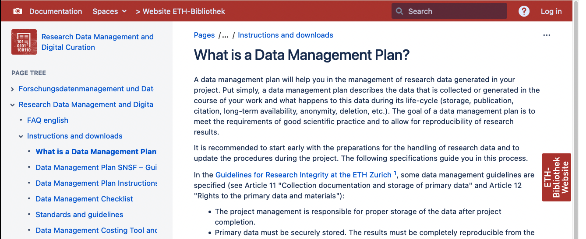

```{r child = "../setup.Rmd"}
```

```{r}
library(tidyverse)
library(lubridate)
```

# Today

1. Homework Assignment 4 - Solutions
2. Research Data Management
3. Data Organisation in Spreadsheets
4. Metadata and Codebooks
5. Using ETH SelectSurvey
6. Homework Assignment 5

---
class: inverse, middle

.big[Homework Assignment 4]

---
# Think, Pair, Share

.question[
1. What is the difference between markdown and R Markdown?
2. How does a file written in markdown differ from a file in a proprietary file fornat (e.g. .docx)? 
]

.your-turn[
- **Think** for 2 minutes
- **Pair** with your neighbour for 5 minutes
- **Share** your answer with the class
]

---
class: left
background-image: url(img/assignment-solutions.png)
background-size: contain

# Homework Assignment 4 - Solutions

---
class: left
background-image: url(img/illustration-slides-week4.010.png)
background-size: contain


---
class: inverse, middle

.big[Research Data Management]

---
# Research Data Management

> Acronym: RDM. Refers to the organisation, storage and preservation of data created during a research project. It covers initial planning, day-to-day processes and long-term archiving and sharing. Shortened to RDM. - [Reference](https://the-turing-way.netlify.app/afterword/glossary.html#term-Research-Data-Management)

---
# Research Data Management

- ensures efficiency in research workflows
- enables greater reach and impact ([FAIR principles](https://the-turing-way.netlify.app/reproducible-research/rdm/rdm-fair.html?highlight=fair))
- prevents loss and data corruption
- documentation and metadata ensures access and enables reuse for others

???
1. You will always find your data
2. You get recognition for all research outputs
3. You stimulate collaboration who find it easier to understand and reuse your data


---
class: middle

## .large[The FAIR principles]


---
class: left
background-image: url(https://the-turing-way.netlify.app/_images/fair-principles.jpg)
background-size: contain

.footnote[The Turing Way Community, & Scriberia. (2021). Illustrations from the Turing Way book dashes. Zenodo. https://doi.org/10.5281/zenodo.5706310]

???

The FAIR guiding principles for scientific data management and stewardship were developed as guidelines to improve the:

- Findability, 
- Accessibility, 
- Interoperability and 
- Reusability of digital assets; 

all of which support research reproducibility. The FAIR principles play an important role in making your data available to others for reuse.

Reference: https://the-turing-way.netlify.app/reproducible-research/rdm/rdm-fair.html?highlight=fair#

---
class: middle

## .large[Research Data Lifecycle]


---
##  Research Data Lifecycle 

<iframe width="1000" height="515" src="https://www.youtube.com/embed/-wjFMMQD3UA" title="YouTube video player" frameborder="0" allow="accelerometer; autoplay; clipboard-write; encrypted-media; gyroscope; picture-in-picture" allowfullscreen></iframe>

.footnote[Reference: https://www.youtube.com/watch?v=-wjFMMQD3UA]

???

### Point out

1. Planning research

- data management plans right in the beginning when you design your research

2. Collecting data

- We will get into capturing data with metadata

3. Processing and analysing data

- That's what will start from week 8

4. Publishing and sharing data

- That's what most of today is about
- We have already talked about licenses

5. Preserving data

- Store and backup: You are continously doing that by the use of a remote repository (GitHub)

6. Re-using data

- That's what we hope to be able to do following the course and include you all as co-authors of a publication

---
class: middle

## .large[Data Management Plan]

---
## Data Management Plan

Provides information on five main topics:

1. Roles and Responsibilities
2. Type and size of data collected and documentation/metadata generated
3. Type of data storage used and back up procedures that are in place
4. Preservation of the research outputs after the project
5. Reuse of your research outputs by others

.footnote[Reference: https://the-turing-way.netlify.app/reproducible-research/rdm/rdm-dmp.html]

---
## Data Management Plan

Provides information on five main topics:

1. Roles and Responsibilities
2. Type and size of data collected and **documentation/metadata** generated
3. Type of data storage used and back up procedures that are in place
4. Preservation of the research outputs after the project
5. Reuse of your research outputs by others

.footnote[Reference: https://the-turing-way.netlify.app/reproducible-research/rdm/rdm-dmp.html]


---
## Data Management Plan

[
```{r}

```
](https://documentation.library.ethz.ch/pages/viewpage.action?pageId=9207835)

.footnote[Screenshot, 2022-03-22: [ETH Library - Research Data Management and Digital Curation - What is a Data Management Plan?](https://documentation.library.ethz.ch/pages/viewpage.action?pageId=9207835)]

---
class: middle

## .large[Documentation and Metadata]

---
## You got data. Is it enough?

<blockquote class="twitter-tweet" data-conversation="none" data-lang="en"><p lang="en" dir="ltr"><a href="https://twitter.com/tomjwebb">@tomjwebb</a> I see tons of spreadsheets that i don&#39;t understand anything (or the stduent), making it really hard to share.</p>&mdash; Erika Berenguer (@Erika_Berenguer) <a href="https://twitter.com/Erika_Berenguer/status/556111838715580417">January 16, 2015</a></blockquote>
<script async src="//platform.twitter.com/widgets.js" charset="utf-8"></script>


<blockquote class="twitter-tweet" data-conversation="none" data-lang="en"><p lang="en" dir="ltr"><a href="https://twitter.com/tomjwebb">@tomjwebb</a> <a href="https://twitter.com/ScientificData">@ScientificData</a> &quot;Document. Everything.&quot; Data without documentation has no value.</p>&mdash; Sven Kochmann (@indianalytics) <a href="https://twitter.com/indianalytics/status/556120920881115136">January 16, 2015</a></blockquote>
<script async src="//platform.twitter.com/widgets.js" charset="utf-8"></script>

.footnote[Slide taken from: https://annakrystalli.me/rrresearchACCE20/metadata-slides.html#metadata-slides]

???
Question on Twitter:

**If you could tell a new PhD student one thing to help make their data more useful/shareable, what would it be?**


---
## You got data. Is it enough?

<blockquote class="twitter-tweet" data-conversation="none" data-lang="en"><p lang="it" dir="ltr"><a href="https://twitter.com/tomjwebb">@tomjwebb</a> Annotate, annotate, annotate!</p>&mdash; CanJFishAquaticSci (@cjfas) <a href="https://twitter.com/cjfas/status/556109252788379649">January 16, 2015</a></blockquote>
<script async src="//platform.twitter.com/widgets.js" charset="utf-8"></script>

<blockquote class="twitter-tweet" data-conversation="none" data-lang="en"><p lang="und" dir="ltr">Document all the metadata (including protocols).<a href="https://twitter.com/tomjwebb">@tomjwebb</a></p>&mdash; Ward Appeltans (@WrdAppltns) <a href="https://twitter.com/WrdAppltns/status/556108414955560961">January 16, 2015</a></blockquote>
<script async src="//platform.twitter.com/widgets.js" charset="utf-8"></script>

.footnote[Slide taken from: https://annakrystalli.me/rrresearchACCE20/metadata-slides.html#metadata-slides]

---
# Think, Pair, Share

<blockquote class="twitter-tweet" data-lang="en"><p lang="en" dir="ltr">You download a zip file of <a href="https://twitter.com/hashtag/OpenData?src=hash">#OpenData</a>. Apart from your data file(s), what else should it contain?</p>&mdash; Leigh Dodds (@ldodds) <a href="https://twitter.com/ldodds/status/828657155863638016">February 6, 2017</a></blockquote>
<script async src="//platform.twitter.com/widgets.js" charset="utf-8"></script>

.footnote[Slide taken from: https://annakrystalli.me/rrresearchACCE20/metadata-slides.html#metadata-slides]

---
# Think, Pair, Share

## **Thought experiment: Imagine a dream open data set**

.question[
1. How would you locate it?
1. What details would you need to know to determine relevance? 
2. What information would you need to know to use it?
]

```{r, out.width="50%"}
knitr::include_graphics("img/missing-unicorn.jpg")
```

.footnote[Slide adapted from: https://annakrystalli.me/rrresearchACCE20/metadata-slides.html#metadata-slides]


---
# ETH library

## Data Management Plan Instructions for ETH Zurich Researchers

**Section 1: Data collection and documentation**

- 1.3 What documentation and metadata will you provide with the data?
    - What information about your data (i.e., metadata) is required to make reuse of your data in the future?
    - Are you using certain community standards for the annotation of metadata?
    - How will data documentation be carried out?
    
.footnote[[Data Management Plan Instructions for ETH Zurich Researchers](https://documentation.library.ethz.ch/display/DD/Data+Management+Plan+Instructions+for+ETH+Zurich+Researchers)]

---
#### Q1: What information about your data (i.e., metadata) is required to make reuse of your data in the future?

- Codebook or data dictionaries that define and explain all variables in your data
- A human and machine-readable file (e.g. README.md) that contains general information on:
    - Title of the dataset
    - Description of the dataset
    - Author information (Name, Institution, Address, Email)
    - Date of data collection (begin, end)
    - Geographic location of data collection
    - Information about funding sources that supported the collection of the data
- A license to clarify reuse possibilties

---
#### Q2: Are you using certain community standards for the annotation of metadata?

- General metadata standards (e.g. [DublinCore](https://www.dublincore.org/specifications/), [schema.org](https://schema.org/), [R3data.org](https://www.re3data.org/))
- Domain specific standards (**we won't get into this**)

---
#### Q3: How will data documentation be carried out?

- Repository hosted on GitHub has data folder
- Data folder contains
  - one codebook (stored as CSV) that describes all variables following guidelines in [OSF - How to Make a Data Dictionary](https://help.osf.io/hc/en-us/articles/360019739054-How-to-Make-a-Data-Dictionary)
  - of all datasets following [schema.org](https://schema.org/) standard
  - one README per dataset that contains general information for each dataset, following variation of [Cornell University README template](https://cornell.app.box.com/v/ReadmeTemplate)
  - a LICENSE that clarifies the use of data [CC-BY](https://creativecommons.org/licenses/by/4.0/)


---
class: inverse, middle

.big[Data Collection Tools]

---

- Survey vs experimental data collection

---
# Data Collection Tools

**Commonly used in our sector**

- KOBO Toolbox
- mWater
- OpenDataKit

---


---
class: inverse, middle

.big[Data Collection Tools]


---
# Example Questionnaire

.your-turn[
- [Please fill out this questionnaire](https://evaluation-app1.let.ethz.ch/TakeSurvey.aspx?SurveyID=l81M8n46)
]

---
# data spice R Package

- https://annakrystalli.me/rrresearchACCE20/slides/04_metadata.html#22
- https://docs.ropensci.org/dataspice/index.html


---
# Assignment 4

1. Watch the video on "What is ORCID?" and get an ORCID profile: https://the-turing-way.netlify.app/communication/citable/citable-orcid.html#cm-citable-orcid
2. 